---
layout:	default
title:	Final Report
---

# {{ page.title }}

## Video Summary
<iframe width="560" height="315" src="https://www.youtube.com/embed/dHg8jZCkW9Q" frameborder="0" allowfullscreen></iframe>

## Project Summary

This project is an AI that takes a provided picture and builds it in Minecraft. The AI takes in an image and processes that image into a collection of pixels, which makes it easier to apply to Minecraft. This is made possible using the external resource OpenCV. We also made a dictionary of Minecraft blocks that are available to use in building the image. The AI would then use this dictionary to compare to each pixel and determine the closest blocks based on RGB values to use when recreating the image. The result is a replica of the image built vertically in Minecraft. Because Minecraft has a vertical limit, large pictures wouldn't be able to be replicated without being cutoff. Therefore, we added a way to re-size the image, also made possible by OpenCV. We made a GUI to make our project more user friendly by letting users input the image name and desired resolution. Additionally, we translated an image's perceived depth into Minecraft to create a 3D looking or pop-up image by situating blocks in different Z-layers to recreate that depth, instead of having a flat image.

## Approaches
### RGB Colors and Minecraft Blocks
For converting the image into a usable collection, we use OpenCV to convert the image into a collection of each pixel’s RGB values. The list of the Minecraft blocks provided is a dictionary full of block IDs, such as “diamond_block”, as keys. The value of each item in the dictionary would be the average RGB values of that block’s texture. We’ve only included a short list of Minecraft blocks, excluding many Minecraft blocks that would be unsuitable for creating an accurate image, like stairs or glass. The AI then creates a new image made of blocks by comparing each pixel's RGB values to the values in the dictionary. We find the block with the closest RGB value by minimizing the distance between the 3-tuple representing the color.

### Attempting PCA
Initially, we tried re-sizing the image using PCA. However, this approach changed the image significantly, as the RGB values mixed in such a way that the colors were completely different from the original. PCA also only re-sized in one dimension, which further distorted the image. Instead we turned to OpenCV once again, which proved to be much more effective at re-sizing the image the way we expected. 

### Translating Depth into Minecraft
For recreating depth, we also used OpenCV which has a distance transform method. The distance transform calculates the distance to the closest zero pixel of the source image. This returned a 2D depth map which we used to map each pixel to an appropriate Z-layer. This would then be translated into Minecraft by placing blocks farther away from the player depending the Z-value. Initially we tried 100 layers to represent the percentage of the pixel, but the image became too distorted. After a number of tests, we then dropped it down to 10 layers and added a 3 block spacing between the layers and found that this worked well. In the final version of the project, we updated it to have 25 layers with a 2 block spacing to emphasize the depth more while still retaining clarity.

#### 'Jetty' Original, Depth Map, and Minecraft Render
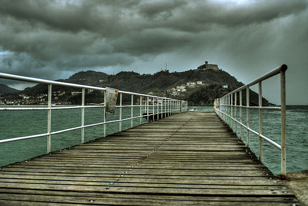
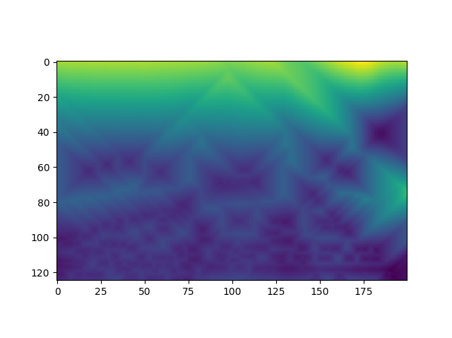
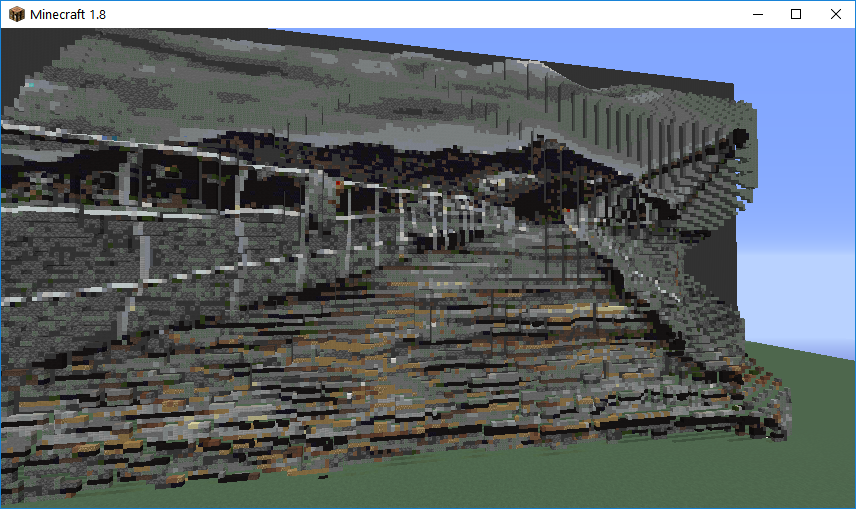

#### 'Pool Balls' Original, Depth Map, and Minecraft Render
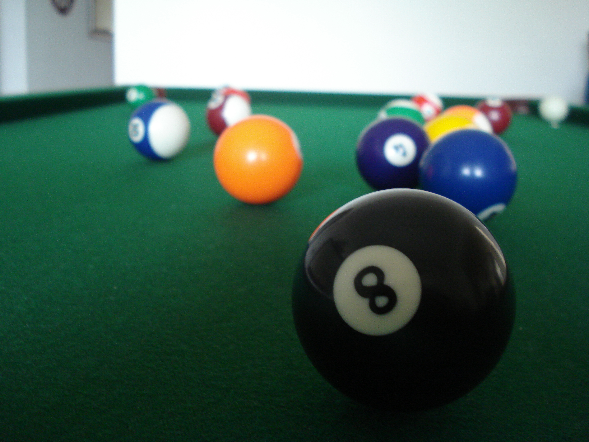
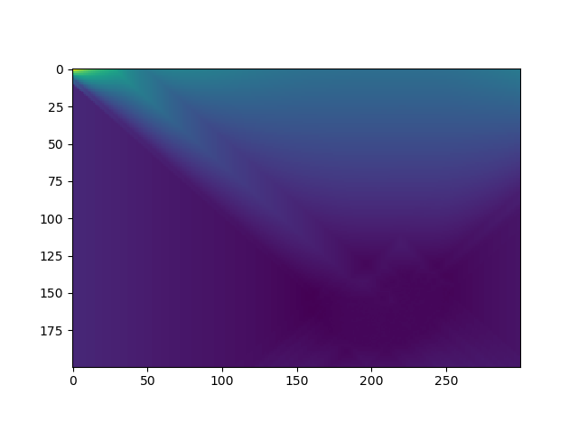
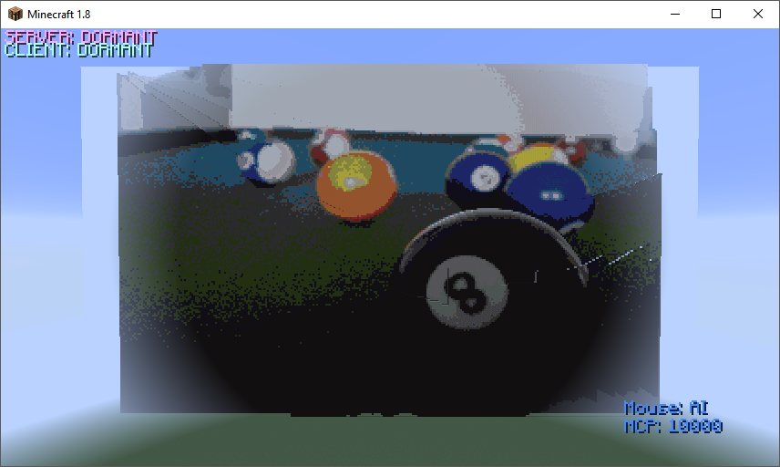

#### 'Double Rainbow' Original, Depthe Map, and Minecraft Render
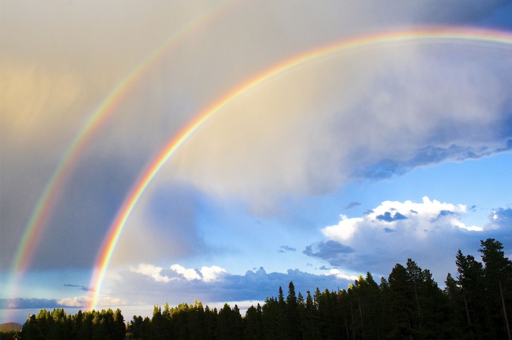
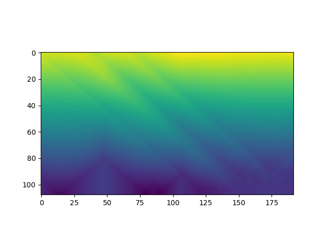
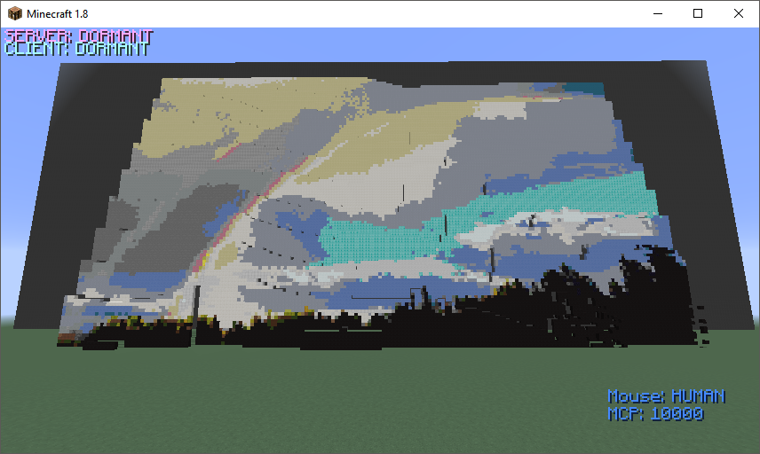

#### Dilation & Watershed
In an attempt to improve our depth map, we tried using dilation and watershed techniques. It retains shape of objects so that distinct objects are separated. Therefore, the foreground and background objects would be correctly separated. Right now, the distance transform smooths the distances, so parts of the same object will be on different layers. However, this proved to be very difficult to implement and resulted in poor recreations of images. In the end, we left it out of our project.

## Evaluation
### Quantitative Evaluation
For our quantitative evaluation, we determine accuracy by calculating error between the Minecraft blocks’ RGB values to the image’s RGB values. This tells us how close the colors of the replica are to the colors in the picture. These calculations will help us reevaluate how our AI recreates the image and make sure it maintains its most important aspects.  These error calculation numbers were decreased from around 80 RGB numbers off to around 20 on average.  This was accomplished by adding more blocks into our AIs reference of Minecraft blocks and their average RGB values.  It was also improved by removing certain blocks from the AI's block selection logic in order to take out weirdly colored blocks or blocks that would interact with other blocks (such as the pumpkin on two blocks of snow creating a snowman).

#### RGB Error Rates
Image |  | Error |  |
--- | --- | --- | --- |
Jetty |  | 19.706 |  |
Pool Balls |  | 29.416 |  |
Double Rainbow |  | 28.608 |  |

### Qualitative Evaluation
Our qualitative evaluation is primarily based on how accurate the replication of the image looks as well as how interesting it looks. This includes doing basic visual comparisons between the replica in Minecraft and the original. We also compare the results from trying different parameters to each other to see which one seems to create the best image in Minecraft. 

We collected feedback by polling people by showing them several copies of the same image with various settings. These settings includes how many different layers to break the depth into, how much of a Z buffer to add between pixels, and what resolution it was.  This feedback was used to select the most popular settings for our AI that should look best to the user. 

An example of the image comparison is shown below.

#### Original Image & 1

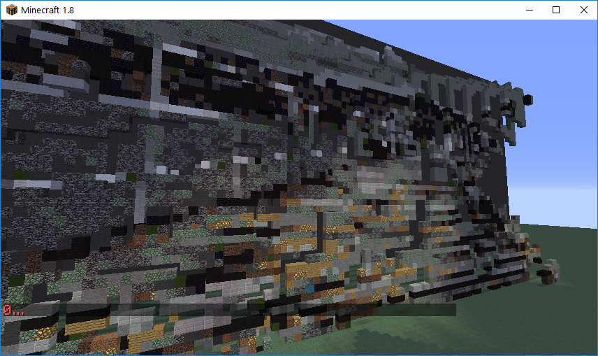
#### 2 & 3
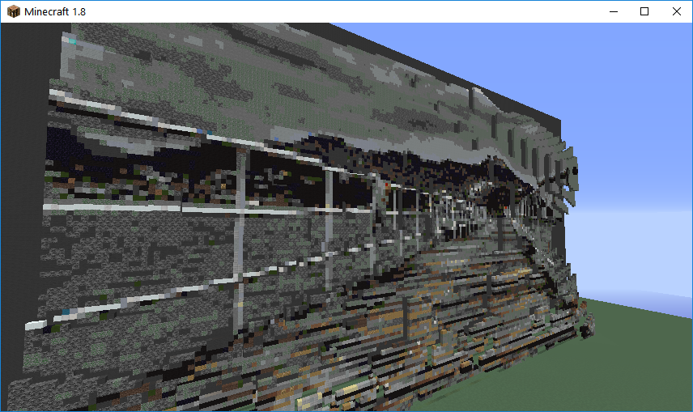
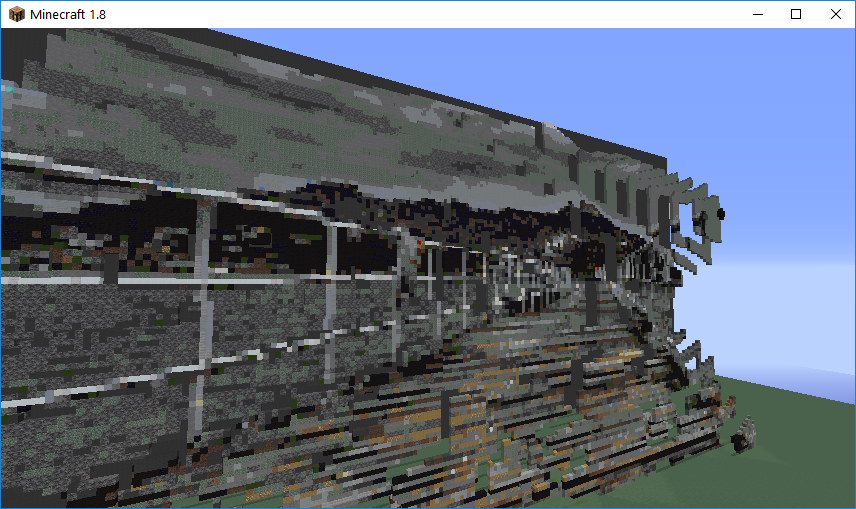
#### 4 & 5

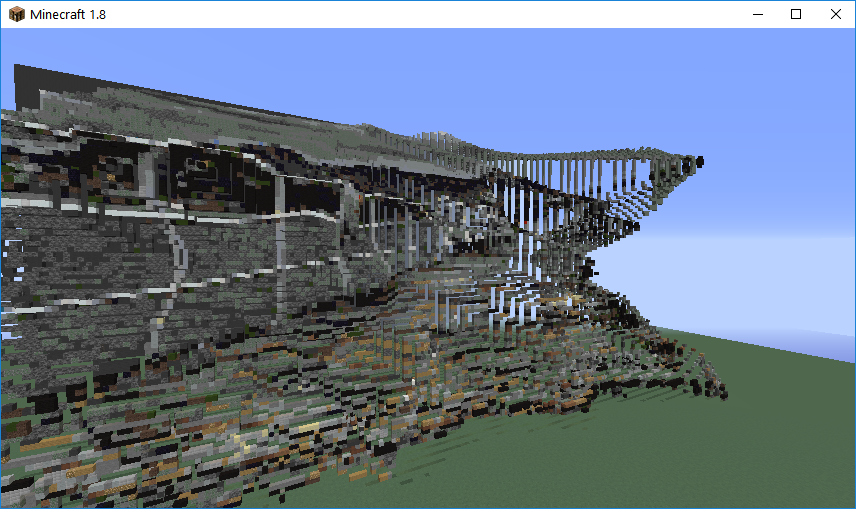

Image|  | Resolution |  | Number of Layers|  | Number of Spaces (between layers)
--- | --- | --- | --- | --- | --- | ---
original |  | 620x415 |  | n/a |  | n/a
1 |  | 100x66 |  | 10 |  | 3
2 |  | 200x125 |  | 10 |  | 3
3 |  | 200x125 |  | 10 |  | 5
4 |  | 200x125 |  | 25 |  | 2
5 |  | 200x125 |  | 50 |  | 3

After our evaluation, we determined that the best settings were 25 layers and 2 spaces.

## References
### Malmo
Malmo is a platform for AI experimentation and research built on top of Minecraft. In this project, it is used to create builds within Minecraft, and bridge the gap between our code and Minecraft.

[https://github.com/Microsoft/malmo](https://github.com/Microsoft/malmo)

### OpenCV Image Processing
Sketchy AI uses OpenCV to process images. OpenCV is an open-source computer vision library. In this project, OpenCV reads in images, rescales them, and handles depth mapping by using distance transform.

[http://docs.opencv.org/master/d2/dbd/tutorial_distance_transform.html](http://docs.opencv.org/master/d2/dbd/tutorial_distance_transform.html)

[https://github.com/opencv/opencv/blob/master/samples/python/distrans.py](https://github.com/opencv/opencv/blob/master/samples/python/distrans.py)

### Scikit-Image
This project initially used Scikit-Image to process images.  Scikit-Image is a collection of algorithms used for image processing in Python. Sklearn is used in this project to scale down the features of the image. We left this library for OpenCV because the way it manipulated images made depth much harder to calculate out of a picture then the OpenCV library that we are currently using.

[http://scikit-image.org/](http://scikit-image.org/ "Link to Scikit-Image's Site")