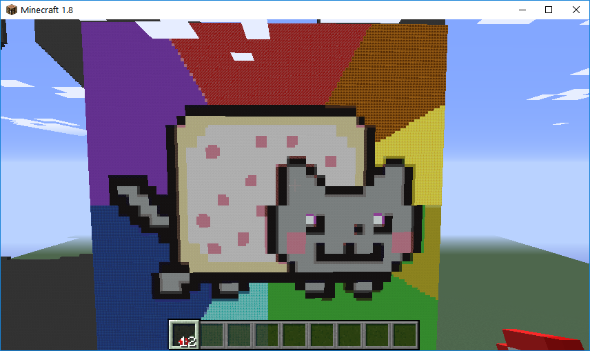

## Code
[https://github.com/Alex561/CS175-Project](https://github.com/Alex561/CS175-Project)

## Screenshots

## Resources
Scikit-Image:
This project uses Scikit-Image for image processing. Scikit-Image is a collection of algorithms used for image processing in Python.
[http://scikit-image.org/](http://scikit-image.org/ "Link to Scikit-Image's Site")
