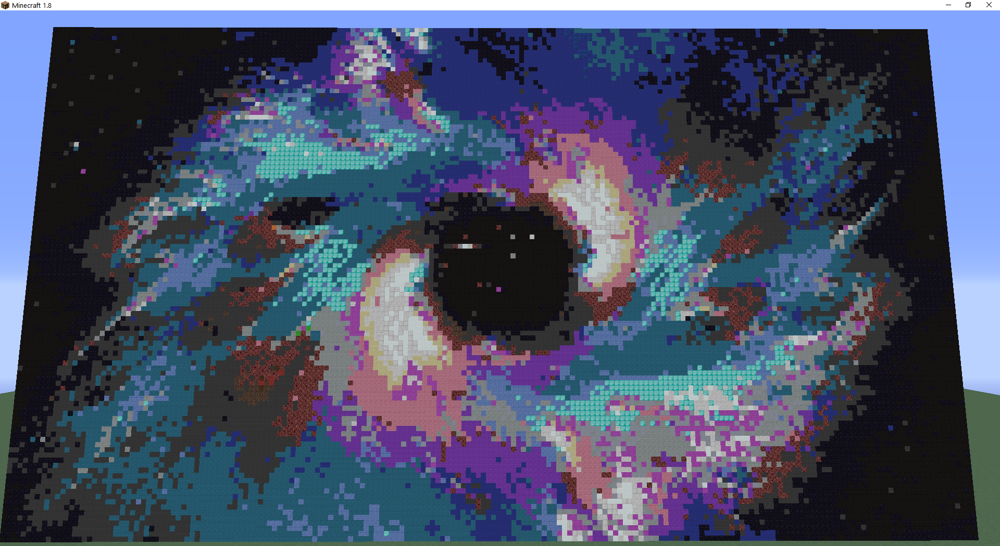
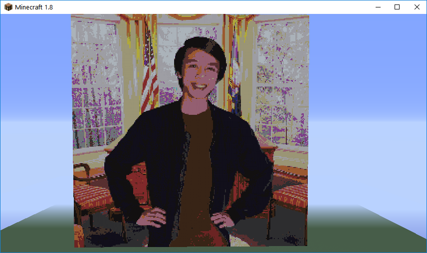

## Code
If you would like to take a look at our project, you can find it here:
[https://github.com/Alex561/CS175-Project](https://github.com/Alex561/CS175-Project)

## Screenshots
Here are some of the results from our testing. We use a variety of images to test the limits of our project.

Recreation of the Overwatch symbol:

GLORIOUS SPACE:

Using a photo:

## Resources
Scikit-Image:
This project uses Scikit-Image in order to process its images. Scikit-Image is a collection of algorithms used for image processing in Python. Check it out here:
[http://scikit-image.org/](http://scikit-image.org/ "Link to Scikit-Image's Site")
