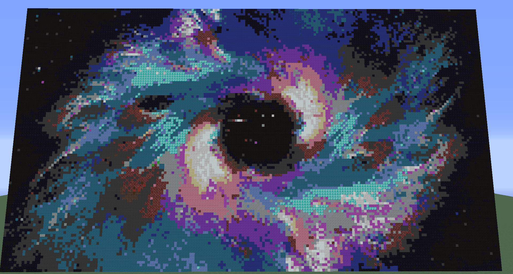

## Summary
Sketchy AI is an AI that takes a provided picture and builds it in Minecraft. The AI takes in an image and processes that image into a collection of pixels, which makes it easier to apply to Minecraft. This is made possible using the external resource Scikit-Image. We also made a dictionary of Minecraft blocks that are available to use in building a vertical image. The AI would then use this dictionary to compare to each pixel and determine the closest blocks to use when recreating the image. The result is a replica of the image built vertically in the Minecraft world environment. Because Minecraft has a vertical limit, large pictures wouldn't be able to be replicated without being cutoff. Therefore, we added a way to resize the image, also made possible by Scikit-Image. We made a GUI to make our project more user friendly by letting users input the image name and desired resize. Additionally, we want to translate an image's perceived depth into Minecraft to create a 3D-looking or pop-up image by situating blocks to recreate that depth, instead of having a flat image.

For more information, check out the website's other pages.

## Code
If you would like to take a look at our project, you can find it here:
[https://github.com/Alex561/Sketchy-AI](https://github.com/Alex561/Sketchy-AI "Sketchy AI")

## Screenshots
Here are some of the results from our testing. We use a variety of images to test the limits of our project.

### Flat Image Screenshots

Recreation of the symbol for the popular video game Overwatch:

Here we used an impressive painting of space we randomly found:

An example of the AI using a photo:

### 3D-ish Image Screenshots

Comparisons of the same photo, but with various parameters:

 

Similarly, a jetty:

 

Here is another photo:

## Resources
#### Malmo
Malmo is a platform for AI experimentation and research built on top of Minecraft. In this project, it is used to create builds within Minecraft, and bridge the gap between our code and Minecraft.

[https://github.com/Microsoft/malmo](https://github.com/Microsoft/malmo)

#### OpenCV Image Processing
Sketchy AI uses OpenCV to process images. OpenCV is an open-source computer vision library. In this project, OpenCV reads in images, rescales them, and handles depth mapping by using distance transform.

[http://docs.opencv.org/master/d2/dbd/tutorial_distance_transform.html](http://docs.opencv.org/master/d2/dbd/tutorial_distance_transform.html)

[https://github.com/opencv/opencv/blob/master/samples/python/distrans.py](https://github.com/opencv/opencv/blob/master/samples/python/distrans.py)

#### Scikit-Image
This project initially used Scikit-Image to process images.  Scikit-Image is a collection of algorithms used for image processing in Python. Sklearn is used in this project to scale down the features of the image. We left this library for OpenCV because the way it manipulated images made depth much harder to calculate out of a picture then the OpenCV library that we are currently using. 

[http://scikit-image.org/](http://scikit-image.org/ "Link to Scikit-Image's Site")